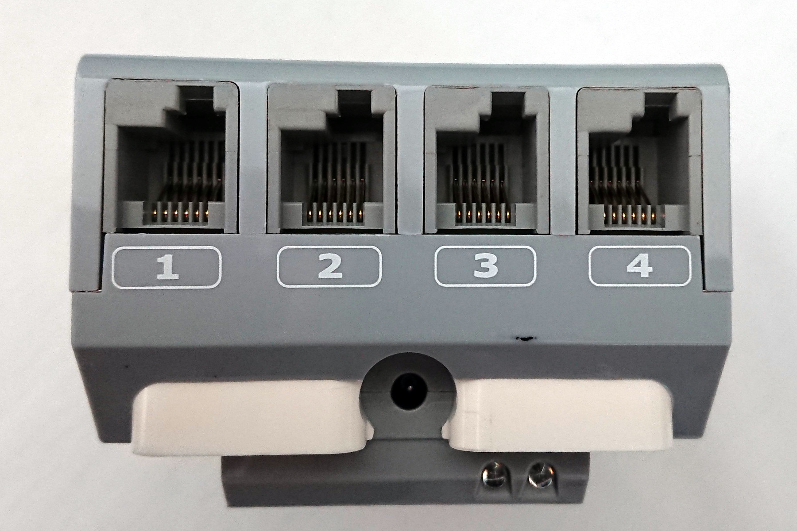

# Getting started with ev3dev and Python for LEGO Mindstorms EV3 (from the command line)
A short guide on how to run the [ev3dev](https://www.ev3dev.org) 
Linux-based operating system on your LEGO Mindstorms EV3 brick,
interact with it using the command line and program it using Python.


# Setup

## Prepare microSD-card 

Download the latest ev3dev image from https://www.ev3dev.org/downloads/ 
(e.g. [ev3dev-stretch-ev3-generic-2020-04-10.zip](https://github.com/ev3dev/ev3dev/releases/download/ev3dev-stretch-2020-04-10/ev3dev-stretch-ev3-generic-2020-04-10.zip))
unpack/unzip it and flash the img-file to a microSD-card:

```
unzip ev3dev-stretch-ev3-generic-2020-04-10.zip

cd ev3dev-stretch-ev3-generic-2020-04-10

sudo dd bs=4M if=ev3dev-stretch-ev3-generic-2020-04-10.img of=/dev/mmcblk0 conv=fdatasync status=progress
```

## Wireless network adapter
Obtain a nano-style usb wireless network adapter like the 
[tp-link TL-WN725N](https://www.tp-link.com/dk/home-networking/adapter/tl-wn725n/)
or one of the adapters listed (and tested) here https://www.ev3dev.org/docs/networking/.

## Plug in
Insert the microSD-card in the microSD card slot 
and your wireless network adapter into the USB-A port.


## Power on / boot
Power on the EV3 brick by pressing button ``[1]``.

It will take 100-140 seconds to boot, 
during this time you'll the LEDs will flash yellow/orange
and a boot screen with an EV3DEV logo.


Once the boot process is complete the display will look like this
and the LEDs will be green.


# Connect to a wireless network
Using the menus and buttons to connect to a wireless network.

Buttons `[3]`, `[4]`, `[5]`, `[6]` change selection 

Botton `[1]` selects

Button `[2]` goes back

1. Navigate to `Wireless and Networks` >> `Wi-Fi`

2. Select `Powered  [ ]` to enable and power the wireless network adapter

3. Select `Start Scan` to scan for available networks

4. Select your desired wireless network from the list.

   

5. Select `Connect` 

6. If your network protected by a passphrase you'll see
   a dialog `Please enter passphrase for <network name>`.

   

   Press button `[1]` once to access an on-screen keyboard.

   

   Use the buttons to type in your passphrase.

   Use the tabs `[ABC]` and `[abc]` to get lower and upper case letters,
   `[123]` to get numbers and `[!@#]` to get special characters.

   Finish by selecting `[OK]` and `[Accept]`.

6. The IP address assigned to your EV3 (by the DHCP server of the network)
   can now be seen in the top of the display, e.g. 192.168.2.88.

   

# Workflow: VS Code

*Note: If you prefer a pure command line workflow see the section
[Workflow: Command line](#workflow-command-line)*

## Installation

Download and install VS Code: https://code.visualstudio.com/Download

Install the extension `ev3dev.ev3dev-browser`
by pressing `[Ctrl]`+`[P]`,
pasting the command `ext install ev3dev.ev3dev-browser`
and pressing `[Enter]`:


## Connect to the EV3
1. Open the **EXPLORER** panel by pressing `[Ctrl]`+`[Shift]`+`[E]` 
   (macOS: `[Cmd]`+`[Shift]`+`[E]`)

2. Unfold **EV3DEV DEVICE BROWSER** 
   and click *Click here to connect ...*

   

3. Select your device from the dropdown list
   (it can take 2-10 seconds for the list to show your device).
   The default device name is `ev3dev`
   but your device might have a different name.

   

4. If your device does not use the default password (`maker`),
   you will have to enter your device's password.

   

   **Note** If you fail to connect by entering the password multiple
   times you might need to add your password to the settings.json file:

   1. Press `[Ctrl]` + `[Shift]` + `[P]`, skriv `user settings json`
      og vælg *Open User Settings (JSON)*.

      
   
   2. A file called `settings.json` is opened. 
      Change the text `"ev3devBrowser.password": ""`
      to `"ev3devBrowser.password": "y0urp455w0rd"`
      and save the file (`[Ctrl]` + `[S]`)

   3. Try to connect to your device again

## Transfer files to the EV3

1. Create a new folder to hold the files (programs) 
   you will be creating and transferring to the EV3,
   e.g. `projects/ev3programs`.

2. Open this folder in VS Code by pressing `File` > `Open Folder`
   (`[Ctrl]`+`[K]` followed by `[Ctrl]`+`[O]`)
   and selecting the folder you've just created.
   
3. Create a new file by pressing `[Ctrl]`+`[N]`, 
   add the following 5 lines of code and save it as `hello.py`

   ``` python
   #!/usr/bin/env micropython
   import time
   for i in range(10):
       print("Hello", i)
   time.sleep(2)
   ```

4. Transfer the files to the EV3 by pressing the 
   ``Send workspace to device``

   

5. The file `hello.py` should now be visible in the *EV3DEV DEVICE BROWSER*.


## Run programs

### Output in VS Code 
Right-click on the file `hello.py` in the *EV3DEV DEVICE BROWSER*
and choose *Run in interactive terminal*.

This is the easiest way to test and debug programs,
since the output and any errors are displayed in the VS Code terminal.


### Output on EV3-screen
Right-click on the file `hello.py` in the *EV3DEV DEVICE BROWSER*
and choose *Run*.


### Using only the EV3
Programs (once transfer to the EV3) can be run by using the
*File Browser* on the EV3:

Errors are not shown anywhere, but written to a file on the EV3
called `hello.py.err.log` (if the file run was `hello.py`).
To see the error message(s) this file will have to be transferred 
to the computer by right-clicking it in the *EV3DEV DEVICE BROWSER*
and choosing *Upload*.


# First Python program to control motors and sensors
ev3dev comes with a Python module which allows easy control 
of the EV3 motors and sensors.

Connect two **large motors** to output A and D:


Connect a **color sensor** to any input port:



Try (and review) the program `test-motor-colorsensor.py` from the [examples folder](examples/).

It turns the two motors slowly and prints the color sensor value.
The program can be stopped by pressing any of the buttons on the EV3
or by pressing [ctrl]+[c] in the ev3dev shell
(if running the program from the command line).

# Important resources
Before proceeding any further note that this how-to is based
upon the following resources. 
In times of need or when you outgrow this how-to you should visit them.

**ev3dev github repository:** 
[https://github.com/ev3dev/ev3dev-lang-python](https://github.com/ev3dev/ev3dev-lang-python)

**ev3dev library/module documentation:**
[https://python-ev3dev.readthedocs.io/en/ev3dev-stretch/](https://python-ev3dev.readthedocs.io/en/ev3dev-stretch/)

**ev3dev endorsed guides:**
[http://ev3python.com/](http://ev3python.com/)


# Controlling motors 

## Driving a tank
A popular and fun thing to build is a driving base like this:


It has to be controlled or steered like a tank,
changing direction by changing the relative rotational velocity of the wheels
(or tracks).

The ev3dev library offers two ways to drive a tank, demonstrated here:

* [examples/movetank.py](examples/movetank.py)

* [examples/movesteering.py](examples/movesteering.py)


# Sensors

## Color sensor


The following example program demonstrates the various color sensor modes:

[examples/colorsensor.py](examples/colorsensor.py)


## Ultrasonic range sensor


The following example program demonstrates how the ultrasonic sensor can be used:

[examples/ultrasonicsensor.py](examples/ultrasonicsensor.py)

   
# Workflow: Command line

## Connect to your robot using SSH
From the command line (Windows Powershell, macOS Terminal, Linux shell/terminal)
issue the following command

```
ssh robot@<ev3 ip address>
```

```
ssh robot@192.168.1.202
```


The first time you connect you will likely see a prompt like

```
The authenticity of host '192.168.1.202 (192.168.1.202)' can't be established.
ECDSA key fingerprint is SHA256:sNNNlUWTtDtWX0CbCLcC83h8Yohuql2x2f6elfXKf+c.
Are you sure you want to continue connecting (yes/no/[fingerprint])?
```

Type `yes` and press [Enter] 
(if you want to know more do an internet search for `ssh fingerprint`
it is an important concept).

Proceed to type in the default ev3dev password (for the user robot)
which is `maker` and press [Enter]. 
**Note** you will likely not see any characters as you type.

The process is complete once you see the following prompt in your terminal

```
Linux ev3dev 4.14.117-ev3dev-2.3.5-ev3 #1 PREEMPT Sat Mar 7 12:54:39 CST 2020 armv5tejl
             _____     _
   _____   _|___ /  __| | _____   __
  / _ \ \ / / |_ \ / _` |/ _ \ \ / /
 |  __/\ V / ___) | (_| |  __/\ V /
  \___| \_/ |____/ \__,_|\___| \_/

Debian stretch on LEGO MINDSTORMS EV3!
Last login: Thu Oct 29 13:37:00 2020 from 192.168.1.2
robot@ev3dev:~$
```

This (a terminal showing `robot@ev3dev:`) is I will call the **ev3dev shell**.

Here you can enter Linux commands and have them executed by ev3dev and the EV3.

Try a few:

* pwd
* ls -la
* ping 8.8.8.8
* touch newfile.txt
* wget https://www.random.org/integers/?num=10&min=1&max=6&col=1&base=10&format=plain&rnd=new
* git clone https://github.com/jonascj/lego-mindstorms-ev3dev-python-how-to.git

## Change password
Change the default password 
(as you should do with all new devices)
by issuing the command

```
passwd
```
It will aks you for you current password (`maker`) and a new password (twice).

After you see the message `passwd: password updated successfully`
close your terminal and connect again with ssh using your new password.

## Your first Python program for your EV3

In order for ev3dev and EV3 to run a Python program 
a Python file needs to be created on or transfered to the ev3dev filesystem. 
There are several ways to do this:

* If you are **experienced** with **linux** or the **command line in general**
  you can start here: [ev3dev shell and a command line editor](#ev3dev-shell-and-a-command-line-editor)

* Otherwise have a look at this worklow: [Local text editor and scp](#local-text-editor-and-scp)

### ev3dev shell and a command line editor

1. Create and edit a .py file with editors vim or nano
(or any other CLI way of writing files)

2. Execute the program as `micropython <file>`, e.g. `micropython test.py`.

   If you perform `chmod +x <file>` (and have the proper shebang in your file)
   you can also execute the program from the menu `File Browser` on the EV3.

   **Recommendation**: Consider adding the `#!/usr/bin/env micropython` shebang to your files,
   making them executable with `chmod +x <file>` and
   executing your programs using the ev3dev utility **brickrun**: 
   `brickrun file.py`. 
   If your program crashes or you terminate it with [ctrl]+[c]
   motors are still stopped by the brickrun utility (which is nice).

Try a test / hello-world program like this:

```
#!/usr/bin/env micropython
import time
for i in range(10):
    print("Hello")
time.sleep(2)
```

### Local text editor and scp
In this workflow you'll be creating Python proggrams
in your usual text editor / IDE (IDLE, Notepad++, Visual Studio Code etc.)
and transfering them to the ev3dev using a command line utility called **scp**
(secure copy protocol):

1. Create a Python file with the following content 
   somewhere meaningful in your local filesystem / on your local storage.

   ```
   #!/usr/bin/env micropython
   import time
   for i in range(10):
       print("Hello")
   time.sleep(2)
   ```

2. From the command line 
   (remember to change working directory to where you saved your .py-file)
   issue the following command which transfers the file to your EV3:

   ```
   scp <file> robot@<ev3 ip address>:
   ```

   ```
   scp test.py robot@192.168.1.202:
   ```

   Note the `:` and the end of the command.

   You'll be asked the password for the user robot 
   (hopefully it is not `maker` since you changed it, right?).

   **Note for Windows**: If the `scp` command causes 
   you trouble see [Note on scp for Windows](#note-on-scp-for-windows)

3. From an ev3dev shell verify the file is there by using `ls -l`


Now the program is ready to be executed by the ev3dev/EV3.
There are two ways of doing this:

 * [Run from command line](#run-from-command-line)
 * [Run from EV3 menus (brickman)](#run-from-ev3-menus-brickman)

### Run from command line
In some respects the easiest way of executing a program is
from the command line (the ev3dev shell).

1. Open an ev3dev shell

2. Run the program by issuing the command

   ```
   micropython <file>
   ```

   ```
   micropython test.py
   ```

Any output (from ``print()``) will be shown in the ev3dev shell
as will any errors.

**Recommendation:** Make your files executable by with the command
`chmod +x <file>` (e.g. `chmod +x test.py`) and 
run/execute your programs like this: `brickrun test.py`
(instead of `micropython <file>`, 
it turns the motors off in case of errors or you pressing [ctrl]+[c]).

### Run from EV3 menus (brickman)
Another option is to run the program from the menus on the EV3 display
(called brickman, short for brick manager).

1. First the file needs to be made executable.
   From an ev3dev shell issue the command
   
   ```
   chmod +x <file>
   ```
   
   ```
   chmod +x test.py
   ```
   
   You can verify permissions with the command `ls -l`,
   your file should be listed as `-rwxr-xr-x ... test.py` (note the `x`s).
   

2. Use the `File Browser` menu on the EV3 display 
   to select and thereby execute your file.

   Output from `print()` will be shown on the display.
   The output, however, disappears once the program terminates.
   Hence the output of a program consisting of a few `print()` statements
   will not be visible (it disappears to quickly).
   That is why the example program above has a ``time.sleep(2)`` statement
   at the end to keep the output visible for 2 seconds.


# Note on scp for Windows

The scp command *might* not be available in Windows per default.

I've personally found it avilable in the following versions of Windows 10,
working exactly like described in this how-to, 
from both the Command Prompt (cmd.exe) and the PowerShell:

* Windows 10 Home, version 1809, build 17763.253, installed 06-01-2019, PowerShell version 5.1.17763.134
* Windows 10 Home, version 20H2, build 19042.508, installed 03-11-2020, PowerShell version 5.1.19041.1

If it is not available to you or continue to cause you trouble you can
install PuTTY and use the `pscp` command it provides instead:

1. Download and install [PuTTY](https://www.chiark.greenend.org.uk/~sgtatham/putty/latest.html),
   e.g. putty-0.74-installer.msi.

2. Restart your PowerShell (or close it and start a new one)

3. Use the command `pscp -P 22 robot@<ev3 ip address>:` instead (note the `:`),
  e.g. `pscp -P 22 robot@192.168.1.202:`.

Somewhere around 2018-2019 Microsoft started including OpenSSH utilities in Windows 10,
including scp.
So the output of the command `scp` should be 
```
scp 	[-346ABCpqrTv] [-c cipher] [-F ssh_config] [-i identity_file] [-J destination] [-l limit] [-o ssh_option] [-P port] [-S program] source ... target
```
Just like [OpenSSH scp utility](https://man.openbsd.org/scp.1).
